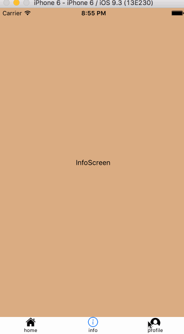

*********************
React Native Examples
*********************

Welcome to **React Native Examples**.  This Repository aims to provide some insight into building some of the more interesting aspects of React-Native.  This repo currently features the following examples.

* **Navigation**
    - NavigationExperimental + Redux
    - CardStack
    - Tabs

* **Redux Remote Dev Tools**

* ****

Prerequisites
=============

* `React Native`_

    - Xcode 7.3+

* npm - 3.9.3
* node - 4.4.5

**NOTE:**  The above NPM versions are the ones I had installed when I made this repo.

Quickstart
==========

1. Clone this repo
------------------

.. code-block:: bash

    $ git clone https://github.com/tkjone/react-native-examples.git

2. Move into your local react_native_examples
---------------------------------------------

.. code-block:: bash

    $ cd react-native-examples

3. Install Dependencies
-----------------------

.. code-block:: bash

    npm install

4. Start the packager
---------------------

.. code-block:: bash

    npm start

5. Open the project in Xcode
----------------------------

.. code-block:: bash

    open ios/react_native_examples.xcodeproj

From here you can choose the simulator to use and then build the project.

Overview
========

Project Structure
-----------------

while React Native is still young, you may be wondering a good way to organize your project, a general rule of thumb is to borrow from React projects and iterate from there.  Here are two common ways to organize your React/React Native project:

**Nature Based Structure**

.. code-block:: bash

    ├── actions
    ├── components
    ├── constants
    ├── app.js
    ├── libs
    ├── stores
    └── main.js

`Nature Based Structure`_

**Structure 2**

.. code-block:: bash

    ├── common
    ├── constants
    │   └── colors.js
    ├── modules
    │   └── moduleName
    |       ├── moduleIndex.js
    │       ├── moduleNameReducer.js
    │       └── moduleNameActions.js
    └── main.js

`Domain Based Structure`_

For this project I wanted to explore a ``Domain`` based structure because I have been on large projects and ran into some issues with a pure ``Nature`` based structure.

Navigation
----------

**What is NavigationExperimental?**

.. epigraph::

   React-Native provides three different API's for implementing Navigation:  ``Navigator``, ``NavigatorIOS`` and ``NavigationExperimental``.  Of these components, the first two are more commonly used because they are the original navigation components which means more stability and more documentation.  Having said this, over the next several months(?) ``NavigationExperimental`` will become the fully supported API for implementing navigation in React Native.

**Why would you use one over another and is there anything preventing me from using it right now?**

.. epigraph::

   ``NavigationExperimental`` will allow you to build more complex, platform agnostic navigation structures.  Having said this, aside from `a few articles`_, some `excellent repositories`_ and the React Native UI Explorer's examples, ``NavigationExperimental``'s documentation is sparse, and it's API is actively being developed which means you have to pay attention to the RN development process and code accordingly.
   Having said this, ``NavigationExperimental`` is great and the above should not deter you from working with it, which is why I made this repo.  Hopefully, you can take some points from here or build upon this example.

**What functionality is in this demo?**

.. epigraph::

    - Tabbar
    - Navigation Actions:  push, jumpToTab, reset tab stack
    - Custom Navigation Reducers

**What are some good resources to expanding on this demo/ learn more about NavigationExperimental?**

.. epigraph::

    I have been working with NavigationExperimental for the past 3 months.  In that time I used everything from the out-of-the-box NavigationContainer, ReactNative Reducers and ``NavigationStateUtils``, to building my own custom NavigationContainer and reducers.  The  ``NavigationStateUtils`` provided by ``NavigationExperimental`` are awesome, so keep rocking them.

    As I mentioned above, documentation is sparse, so the best way to learn is by going through these resources first:

    `Get some history of the project from the original creators`_

    `Then read this good intro article about NavigationExperimental`_

    `Then see what the community is doing with NavigationExperimental and Redux`_

    After you have a bsaic understanding, I recommend diving into React Native source code and see what ``NavigationExperimental`` under the hood.  I usually open up a new browser window dedicated to my ReactNative source code and open up the following tabs in this order:

    https://github.com/ericvicenti/navigation-rfc/blob/master/Docs/Navigation.md
    https://github.com/facebook/react-native/blob/0.28-stable/Libraries/NavigationExperimental/NavigationStateUtils.js
    https://github.com/facebook/react-native/blob/0.28-stable/Libraries/CustomComponents/NavigationExperimental/NavigationCard.js
    https://github.com/facebook/react-native/blob/0.28-stable/Libraries/NavigationExperimental/NavigationTransitioner.js
    https://github.com/facebook/react-native/blob/0.28-stable/Libraries/NavigationExperimental/NavigationTypeDefinition.js
    https://github.com/facebook/react-native/blob/0.28-stable/Libraries/NavigationExperimental/Reducer/NavigationScenesReducer.js
    https://github.com/facebook/react-native/blob/81c62c5f41da2e34f0c0e19ca38843918c23c32b/Libraries/CustomComponents/NavigationExperimental/NavigationCardStackStyleInterpolator.js

    Always make sure you are on the right branch!  ``NavigationExperimental`` is moving so quick that there will be a lot of differences between each branch.

    Happy learning!

TO DO
=====

- NavigationHeader
- Back/Pop Actions
- Modals
- Documentation explaining NavigationExperimental and the choices made in this project

.. _`a few articles`: https://medium.com/@dabit3/first-look-react-native-navigator-experimental-9a7cf39a615b#.vanf1kcmh
.. _`excellent repositories`: https://github.com/jlyman/RN-NavigationExperimental-Redux-Example
.. _`React Native`: http://facebook.github.io/react-native/docs/getting-started.html
.. _`Get some history of the project from the original creators`: https://github.com/ericvicenti/navigation-rfc
.. _`Then read this good intro article about NavigationExperimental`: https://medium.com/@dabit3/first-look-react-native-navigator-experimental-9a7cf39a615b#.b46acu7wc
.. _`Then see what the community is doing with NavigationExperimental and Redux`: https://github.com/jlyman/RN-NavigationExperimental-Redux-Example
.. _`Nature Based Structure`: http://survivejs.com/react/advanced-techniques/structuring-react-projects/
.. _`Domain Based Structure`: http://marmelab.com/blog/2015/12/17/react-directory-structure.html
